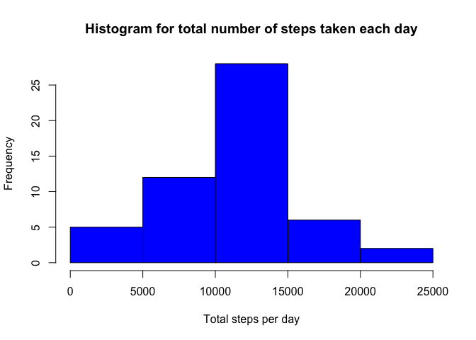
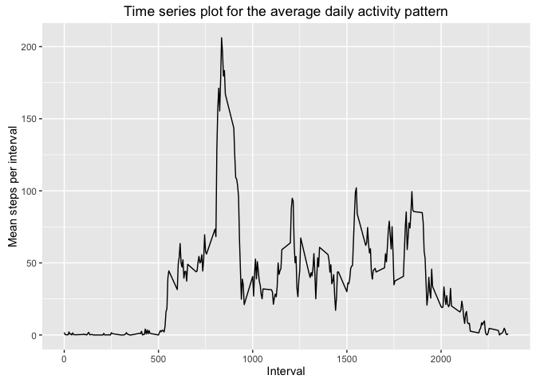
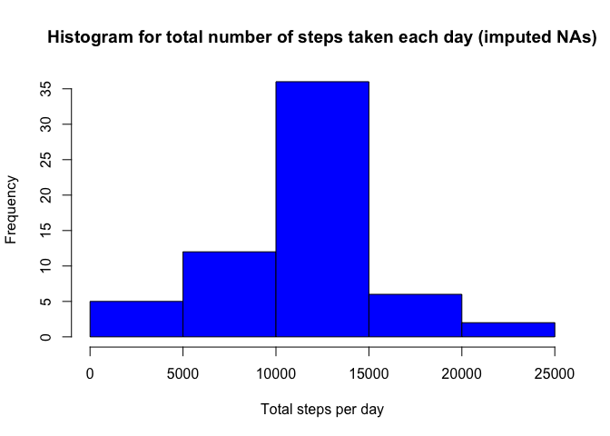
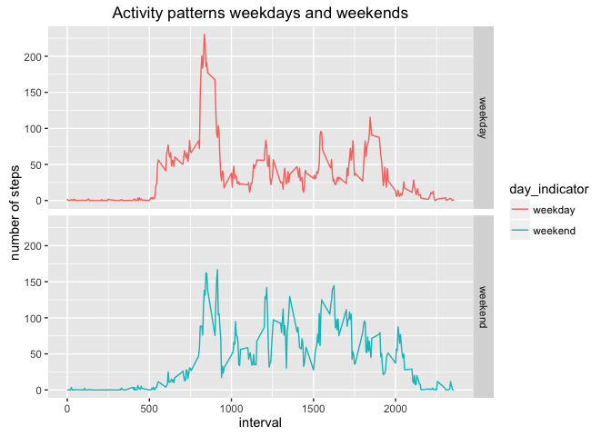

# Peer Graded Assignment: Course Project 1

# Introduction
This assignment makes use of data from a personal activity monitoring device. This device collects data at 5 minute intervals through out the day. The data consists of two months of data from an anonymous individual collected during the months of October and November, 2012 and include the number of steps taken in 5 minute intervals each day.

# Data
The data for this assignment is downloaded from the website [Activity monitoring data](https://d396qusza40orc.cloudfront.net/repdata%2Fdata%2Factivity.zip). Different variables included in the dataset are explained below.

* **steps**: Number of steps taking in a 5-minute interval (missing values are coded as 𝙽𝙰)
* **date**: The date on which the measurement was taken in YYYY-MM-DD format
* **interval**: Identifier for the 5-minute interval in which measurement was taken

The dataset is stored in a comma-separated-value (CSV) file and there are a total of 17,568 observations in this dataset.

# Analysis

The required analysis on the dataset can be found in the below subsections.

## Loading and preprocessing the data

To load the data, we are going to use **read.csv()** function. Following code is responsible to load the csv data. We also use the **str** function to get an overview of the dataset.


```r
zipped_file <- "activity.zip"
unzipped_file <- "activity.csv"
unzip(zipped_file, unzipped_file, overwrite=TRUE)
activity_data <- read.csv(unzipped_file)
str(activity_data)
```

```
## 'data.frame':	17568 obs. of  3 variables:
##  $ steps   : int  NA NA NA NA NA NA NA NA NA NA ...
##  $ date    : Factor w/ 61 levels "2012-10-01","2012-10-02",..: 1 1 1 1 1 1 1 1 1 1 ...
##  $ interval: int  0 5 10 15 20 25 30 35 40 45 ...
```
We will use the **dplyr** package to process and analyze our data.


```r
library(dplyr)
```

```
## 
## Attaching package: 'dplyr'
```

```
## The following objects are masked from 'package:stats':
## 
##     filter, lag
```

```
## The following objects are masked from 'package:base':
## 
##     intersect, setdiff, setequal, union
```

```r
activity_df <- tbl_df(activity_data)
rm(activity_data)
activity_df
```

```
## Source: local data frame [17,568 x 3]
## 
##    steps       date interval
##    (int)     (fctr)    (int)
## 1     NA 2012-10-01        0
## 2     NA 2012-10-01        5
## 3     NA 2012-10-01       10
## 4     NA 2012-10-01       15
## 5     NA 2012-10-01       20
## 6     NA 2012-10-01       25
## 7     NA 2012-10-01       30
## 8     NA 2012-10-01       35
## 9     NA 2012-10-01       40
## 10    NA 2012-10-01       45
## ..   ...        ...      ...
```


## What is mean total number of steps taken per day?

The total number of steps taken per day has been calculated by taking the following steps.

* filter by removing NA values from the *steps* column.

```r
activity_na_filtered <- filter(activity_df, !is.na(steps))
```

* group by date using group_by on the filtered data frame using *date* column.

```r
activity_grouped_by_date <- group_by(activity_na_filtered, date)
```
* summarise the above data by summing up all the steps per group.


```r
activity_sum <- summarise(activity_grouped_by_date, total_steps_per_day = sum(steps))
activity_sum
```

```
## Source: local data frame [53 x 2]
## 
##          date total_steps_per_day
##        (fctr)               (int)
## 1  2012-10-02                 126
## 2  2012-10-03               11352
## 3  2012-10-04               12116
## 4  2012-10-05               13294
## 5  2012-10-06               15420
## 6  2012-10-07               11015
## 7  2012-10-09               12811
## 8  2012-10-10                9900
## 9  2012-10-11               10304
## 10 2012-10-12               17382
## ..        ...                 ...
```

Below, we can see the histogram for total number of steps taken each day.


```r
total_steps_per_day <- activity_sum$total_steps_per_day
hist(total_steps_per_day, main="Histogram for total number of steps taken each day", xlab = "Total steps per day", ylab = "Frequency",col="blue")
```

<!-- -->

The mean and median of the total number of steps taken per day can be calculated as follows. As we can see, the mean of the total number of steps taken per day is 10766.19 and median is 10765.


```r
mean_steps_per_day <- mean(total_steps_per_day)
mean_steps_per_day
```

```
## [1] 10766.19
```

```r
median_steps_per_day <- median(total_steps_per_day)
median_steps_per_day
```

```
## [1] 10765
```

## What is the average daily activity pattern?

In this analysis, we find the average daily activity pattern. We do this by the following steps.

* group by intervals using group_by on the filtered data frame using *interval* column.


```r
activity_grouped_by_intervals <- group_by(activity_na_filtered, interval)
```
* summarise the above data by taking mean for the column *step* for each group generated above.


```r
activity_mean <- summarise(activity_grouped_by_intervals, mean_steps_per_interval = mean(steps))
```
* Now we can make a time series plot using ggplot function provided in ggplot2 package.


```r
library(ggplot2)
ggplot(activity_mean, aes(interval, mean_steps_per_interval)) + geom_line() + ggtitle("Time series plot for the average daily activity pattern") + xlab("Interval") + ylab("Mean steps per interval")
```

<!-- -->

To find out which 5-minute interval contains the maximum number of steps, we can sort the frame in descending order of the *mean_steps_per_interval*. As we can see, the maximum number of steps is *206.1698* hich is between *835* and *840* minutes.


```r
activity_mean <- arrange(activity_mean,desc(mean_steps_per_interval))
activity_mean
```

```
## Source: local data frame [288 x 2]
## 
##    interval mean_steps_per_interval
##       (int)                   (dbl)
## 1       835                206.1698
## 2       840                195.9245
## 3       850                183.3962
## 4       845                179.5660
## 5       830                177.3019
## 6       820                171.1509
## 7       855                167.0189
## 8       815                157.5283
## 9       825                155.3962
## 10      900                143.4528
## ..      ...                     ...
```

## Imputing missing values

The total number of missing values in the dataset can be calculated by calculating the total number of rows with NAs. There are 2304 missing values.


```r
total_missing_values <- sum(is.na(activity_df$steps))
total_missing_values
```

```
## [1] 2304
```

The strategy we use to imput these missing values is to fill them with the mean for that 5-minute interval. The new data set created using this strategy is *activity_imputed_na*


```r
merged_activity_df <- merge(activity_df,activity_mean, by = c("interval"), all = TRUE)
activity_imputed_na <- merged_activity_df %>% mutate(steps = ifelse(is.na(steps), mean_steps_per_interval, steps)) %>% select (steps,date,interval)
```

We again create a histogram of the total number of steps taken each day like before, but this time with the *activity_imputed_na*


```r
activity_imputed_na_grouped_by_date <- group_by(activity_imputed_na, date)
activity_imputed_na_sum <- summarise(activity_imputed_na_grouped_by_date, total_steps_per_day = sum(steps))
total_steps_per_day_na_imputed <- activity_imputed_na_sum$total_steps_per_day
hist(total_steps_per_day_na_imputed, main="Histogram for total number of steps taken each day (imputed NAs)", xlab = "Total steps per day", ylab = "Frequency",col="blue")
```

<!-- -->

If we calculate the mean and median on the total number of steps with imputed NA values, we see that the mean stays the same 10766.19 and the median is now 10766.19. The mean stays the same because we replace all the NA values with the mean steps per interval. We can also see that the mean and median values are not so different from before because of the imputing strategy.


```r
mean_steps_per_day_na_imputed <- mean(total_steps_per_day_na_imputed)
mean_steps_per_day_na_imputed
```

```
## [1] 10766.19
```

```r
median_steps_per_day_na_imputed <- median(total_steps_per_day_na_imputed)
median_steps_per_day_na_imputed
```

```
## [1] 10766.19
```
## Are there differences in activity patterns between weekdays and weekends?

Now we add another factor variable called *day_indicator* in *activity_imputed_na* to indicate whether the date is a weekday or a weekend. 


```r
activity_with_indicator <- activity_imputed_na %>% mutate(day_indicator = ifelse(weekdays(as.Date(date)) %in% c("Saturday","Sunday"), "weekend", "weekday")) %>% mutate(day_indicator = as.factor(day_indicator))
```

To plot the activity pattern for weekdays and weekends, we first group the imputted data set by *interval* and the *day_indicator* columns. Now using the *qplot*, we plot the average number of steps against the intervals.


```r
activity_indicator_grouped_by <- group_by(activity_with_indicator, interval, day_indicator)
activity_indicator_mean <- summarise(activity_indicator_grouped_by, mean_steps_per_interval = mean(steps))
qplot(interval, mean_steps_per_interval, data=activity_indicator_mean, geom="line", group=day_indicator, colour=day_indicator,facets = day_indicator ~., main = "Activity patterns weekdays and weekends", xlab = "interval", ylab = "number of steps")
```

<!-- -->
